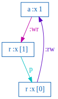
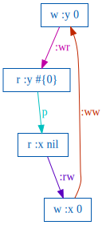
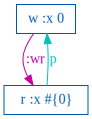

### Jepsen Tests for Causal Consistency

Designed for testing local first systems, CRDTs, and distributed syncing.

[Jepsen](https://github.com/jepsen-io/jepsen) has an established [history](https://jepsen.io/analyses) of testing databases.

These tests have focused on stronger levels of [consistency](https://jepsen.io/consistency), e.g. snapshot-isolation, linearizability, and serializability.

This project explores using Jepsen to test for [Causal Consistency](https://jepsen.io/consistency/models/causal), with Strong Convergence, and atomic transactions ([Monotonic Atomic View](https://jepsen.io/consistency/models/monotonic-atomic-view)).

----

### Uses Elle, Jepsen's Transactional Consistency Checker

#### Adopts Adya's Consistent View(PL-2+) as the base consistency model
> Level PL-2+ ensures that a transaction is placed after all transactions that causally affect it, i.e., it provides a notion of “causal consistency”.
> 
>   -- Adya, [Weak Consistency](https://dspace.mit.edu/handle/1721.1/149899)

#### Modifies Elle's consistency model [graph](https://github.com/jepsen-io/elle/blob/main/images/models.png)

Causal Consistency requires process order.

But Adya doesn't include process order and anomalies with many models, importantly to us, Consistent View(PL-2+).

Elle has already added a strong-session, process order and process anomalies, to most stronger models.

So we complete Elle's existing consistency models by adding a strong-session-consistent-view:
  - adds process graph and process variants of anomalies
  - fills in the gap between existing stronger and weaker forms of strong-session consistency models 

#### Building the Directed Acyclic Graph of Causal Dependencies

We combine:

- process order
   
- w->r order, the write of [k v] happens before all reads of [k v]
   
- w->w order, a write of [k v] is ordered after the writes of all previously observed [k v] in the process
  - (writes follow reads)

- r->w order, infer that all reads that don't observe [k v] happen before the write of [k v]
  - ordering edges are only created for one process at a time
  - each process requires checking itself against the full graph for cycles
    - multiple cycle checks are expensive
  - necessary for causal to reflect a per process view of other processes

----

### Adya Anomalies Expressed

#### Read Your Writes
  - `[:G-single-item-process]`
    ```clj
    [{:process 0, :type :ok, :f :txn, :value [[:w :x 0]],   :index 1}
     {:process 0, :type :ok, :f :txn, :value [[:r :x nil]], :index 3}]
    ```
    ```txt
    G-single-item-process
    Let:
      T1 = {:index 3, :time -1, :type :ok, :process 0, :f :txn, :value [[:r :x nil]]}
      T2 = {:index 1, :time -1, :type :ok, :process 0, :f :txn, :value [[:w :x 0]]}
    
    Then:
      - T1 < T2, because T1's read of [:x nil] did not observe T2's write of [:x 0] (r->w).
      - However, T2 < T1, because process 0 executed T2 before T1: a contradiction!
    ```
    

----

#### Monotonic Writes
  - `[:G-single-item-process]`
    ```clj
    [{:process 0, :type :ok, :f :txn, :value [[:w :x 0]], :index 1}
     {:process 0, :type :ok, :f :txn, :value [[:w :x 1]], :index 3}
     {:process 1, :type :ok, :f :txn, :value [[:r :x #{1}]], :index 5}
     {:process 1, :type :ok, :f :txn, :value [[:r :x #{0 1}]], :index 7}]
    ```
    ```txt
    G-single-item-process
    Let:
      T1 = {:index 5, :time -1, :type :ok, :process 1, :f :txn, :value [[:r :x #{1}]]}
      T2 = {:index 1, :time -1, :type :ok, :process 0, :f :txn, :value [[:w :x 0]]}
      T3 = {:index 3, :time -1, :type :ok, :process 0, :f :txn, :value [[:w :x 1]]}
    
    Then:
      - T1 < T2, because T1's read of [:x #{1}] did not observe T2's write of [:x 0] (r->w).
      - T2 < T3, because process 0 executed T2 before T3.
      - However, T3 < T1, because T3's write of [:x 1] was read by T1 (w->r): a contradiction!
    ```
    

----

#### Monotonic Reads
  - `[:G-single-item-process]`
    ```clj
    [{:process 0, :type :ok, :f :txn, :value [[:w :x 0]], :index 1}
     {:process 1, :type :ok, :f :txn, :value [[:w :x 1]], :index 3}
     {:process 2, :type :ok, :f :txn, :value [[:r :x #{0}]], :index 5}
     {:process 2, :type :ok, :f :txn, :value [[:r :x #{0 1}]], :index 7}
     {:process 2, :type :ok, :f :txn, :value [[:r :x #{1}]], :index 9}]
    ```
    ```txt
    G-single-item-process
    Let:
      T1 = {:index 9, :time -1, :type :ok, :process 2, :f :txn, :value [[:r :x #{1}]]}
      T2 = {:index 1, :time -1, :type :ok, :process 0, :f :txn, :value [[:w :x 0]]}
      T3 = {:index 7, :time -1, :type :ok, :process 2, :f :txn, :value [[:r :x #{0 1}]]}
    
    Then:
      - T1 < T2, because T1's read of [:x #{1}] did not observe T2's write of [:x 0] (r->w).
      - T2 < T3, because T2's write of [:x 0] was read by T3 (w->r).
      - However, T3 < T1, because process 2 executed T3 before T1: a contradiction!
    ```
    

----

#### Writes Follow Reads
  - `[:G-single-item-process :G-single-item ]`
    ```clj
    [{:process 0, :type :ok, :f :txn, :value [[:w :x 0]], :index 1}
     {:process 1, :type :ok, :f :txn, :value [[:r :x #{0}]], :index 3}
     {:process 1, :type :ok, :f :txn, :value [[:w :y 0]], :index 5}
     {:process 2, :type :ok, :f :txn, :value [[:r :y #{0}]], :index 7}
     {:process 2, :type :ok, :f :txn, :value [[:r :x nil]], :index 9}]
    ```
    ```txt
    G-single-item-process
    Let:
      T1 = {:index 9, :time -1, :type :ok, :process 2, :f :txn, :value [[:r :x nil]]}
      T2 = {:index 1, :time -1, :type :ok, :process 0, :f :txn, :value [[:w :x 0]]}
      T3 = {:index 5, :time -1, :type :ok, :process 1, :f :txn, :value [[:w :y 0]]}
      T4 = {:index 7, :time -1, :type :ok, :process 2, :f :txn, :value [[:r :y #{0}]]}
    
    Then:
      - T1 < T2, because T1's read of [:x nil] did not observe T2's write of [:x 0] (r->w).
      - T2 < T3, because T2's write of [:x 0] was observed by process 1 before it executed T3 (wfr).
      - T3 < T4, because T3's write of [:y 0] was read by T4 (w->r).
      - However, T4 < T1, because process 2 executed T4 before T1: a contradiction!
      ```
      

----

#### write -> read
- `[:G1c-process, :G0]`
  ```clj
  [{:process 0, :type :ok, :f :txn, :value [[:r :x #{0}]], :index 1, :time -1}
   {:process 0, :type :ok, :f :txn, :value [[:w :x 0]], :index 3, :time -1}]
  ```
  ```txt
  G1c-process
  Let:
    T1 = {:index 1, :time -1, :type :ok, :process 0, :f :txn, :value [[:r :x #{0}]]}
    T2 = {:index 3, :time -1, :type :ok, :process 0, :f :txn, :value [[:w :x 0]]}
  
  Then:
    - T1 < T2, because process 0 executed T1 before T2.
    - However, T2 < T1, because T2's write of [:x 0] was read by T1 (w->r): a contradiction!
  ```
  

----

#### Internal
- `[:internal]`
  ```clj
  [{:process 0, :type :ok, :f :txn, :value [[:w :x 0]], :index 1}
   {:process 1, :type :ok, :f :txn, :value [[:r :x #{0}] [:w :x 1] [:r :x #{0}]], :index 3}
   {:process 2, :type :ok, :f :txn, :value [[:w :x 2] [:r :x #{0 1}]], :index 5}]
  ```
  ```clj
  {:internal
   ({:op {:process 1, :type :ok, :f :txn, :value [[:r :x #{0}] [:w :x 1] [:r :x #{0}]], :index 3, :time -1},
     :mop [:r :x #{0}],
     :expected #{0 1}}
    {:op {:process 2, :type :ok, :f :txn, :value [[:w :x 2] [:r :x #{0 1}]], :index 5, :time -1},
     :mop [:r :x #{0 1}],
     :expected #{2}})}
  :not #{:read-atomic}
  ```
  
----

#### Type Sanity

All read/write objects in the history are checked for type sanity.

For a grow only set:
  - keys are integers
  - set elements are integers

Throws an exception as a type sanity violation invalidates the test.

----

### Issues, Impedance, and Friction with Adya

  - language has evolved over time
  - not a 1-to-1 mapping between the definition of Causal Consistency, its components, and Adya's models

#### Lost Update Anomaly

Lost update is a violation of Consistent View yet is a valid Causal history.

The update isn't lost, it's eventually and consistently merged. 

```clj
; Adya's Hlost: r1 (x0, 10) r2(x0 , 10) w2(x2 , 15) c2 w1(x1 , 14) c1
;               [x0 << x2 << x1 ]
[{:process 1 :type :invoke :value [[:r :x nil] [:w :x 14]] :f :txn}
 {:process 2 :type :invoke :value [[:r :x nil] [:w :x 15]] :f :txn}
 {:process 2 :type :ok     :value [[:r :x 10]  [:w :x 15]] :f :txn}
 {:process 1 :type :ok     :value [[:r :x 10]  [:w :x 14]] :f :txn}]
```

#### G-single-item Anomaly 

G-single-item is a violation of Consistent View yet ***can*** be a valid Causal history.

It is not a ww|wr inferred rw cycle, it's two transactions in different process:
  - observing other process' at different versions
  - always observing >= versions
  - versions are eventually and consistently merged

To accommodate this causal view, we only infer and evaluate r->w relations in the graph:
  - one process at a time
  - combined with the complete process, w->r, w->w(writes follow reads) graphs
  - this is expensive  

```clj
;; valid causal history, *not* an anomaly
[{:process 0, :type :ok, :f :txn, :value [[:w :x 0]], :index 1}
 {:process 0, :type :ok, :f :txn, :value [[:r :y nil]], :index 3}
 {:process 1, :type :ok, :f :txn, :value [[:r :x nil] [:w :y 1]], :index 5}]
 ```

----

### Challenges of Checking Causal Consistency

Clients can exhibit a variety of behaviors that hide replication failures. Their local view remains consistent until they are forced to merge with the system as a whole.

#### Isolationist
  - only reads/writes from/to local database
  - does not replicate local changes
  - does not listen to other client's updates

#### Selfish
  - does not replicate local changes
  - does listen to other client's updates

#### Cliquish 
  - only replicates to a subset of clients
  - only listens to a subset of other client's updates

A final read followed by an additional check for Strong Convergence is necessary to expose these anomalies.

----

### Strong Convergence

Workload:
- generate a random mixture of reads and writes across all clients
- let database quiesce
- each client does a final read of all keys

Check:
  - all nodes have ok final reads
  - final reads contain all ok writes
  - no unexpected read values
  - final reads are equal for all nodes

----

### Fault Injection

Jepsen faults are real faults:

  - kill (-9) the sync service on each node
    - clients continue to read/write to the database
    - sync service restarted

Less of a fault, and more indicative of normal behavior.

In a local first environment, clients will be coming and going in all manner at all times.

----

### But What About *On Verifying Causal Consistency (POPL'17)* ?!?

> Paraphrasing from the abstract:
> 
> checking whether one single execution is causally consistent is NP-complete
> 
> verifying whether all the executions of an implementation are causally consistent is undecidable
>
> for a read-write memory abstraction, these negative results can be circumvented if the implementations are data independent, use differentiated histories
>
> Bouajjani, A., Enea, C., Guerraoui, R., & Hamza, J. (2017). [On verifying causal consistency](https://sci-hub.se/https://doi.org/10.1145/3093333.3009888). ACM SIGPLAN Notices, 52(1), 626–638. doi:10.1145/3093333.3009888

The authors also introduce a new vocabulary for different levels of causal consistency and "bad patterns" that define them.

Working through the examples in the paper, it appears that using a grow only set with a differentiated history also provides the efficiency gains exclusively using a much simpler graphing convention.

It also reduces the newly introduced consistency levels and "bad patterns" into the more common colloquial definitions and anomalies of Causal Consistency:

Examples from the paper as a grow only set:
- read your writes
  - (a) CM but not CCv
  - (c) CC but not CM nor CCv
- writes follow reads
  - (b) CCv but not CM
- writes follow reads or monotonic reads
  - (e) not CC (nor CM, nor CCv)
- making an argument that "sequentially consistent" is outside the common meaning of Causal Consistency
  - (d) CC, CM and CCv but not sequentially consistent

Experiences of trying to write a checker for a last write wins register using only graphing confirms the paper's assertions that it is hard and expensive.

----

The tests will use [ElectricSQL](https://electric-sql.com/):
  - transactional causal+ consistency
  - local first
  - active/active SQLite3/PostgreSQL CRDT based sync
  - strong research team

----

### Elle Consistency Model Graph Changes

Look for `strong-session-PL-2+`:


----

### Opts to Configure Elle for Causal Consistency

```clj
(def causal-opts
  {:consistency-models [:strong-session-consistent-view] ; Elle's strong-session with Adya's Consistent View(PL-2+)
   :anomalies          [:internal]                       ; basic hygiene to read your writes in a transaction
   :anomalies-ignored  [:lost-update]                    ; `lost-update`s are causally Ok, but they are PL-2+, Adya 4.1.3 ?!?
   })
```
